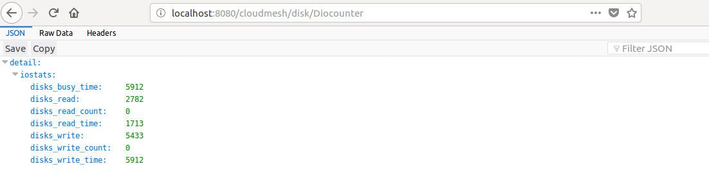
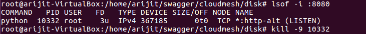

# Test Results - 
## Make Command Execution from Terminal and Browser - 

### From Terminal

### From Browser
* Total Disk

* Used Disk

* Free Disk

* Disk Usage

* Disk Partition

* Disk IO

## Docker Container Execution

Docker Build 

Docker Start 

* Total Disk

* Used Disk

* Free Disk

* Disk Usage

* Disk Partition

* Disk IO

## Kill The process running -

